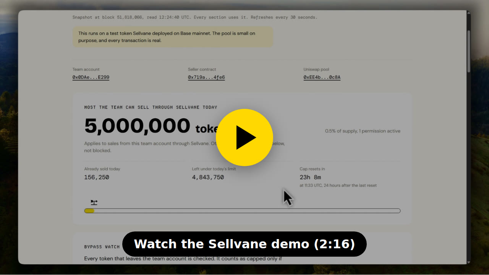
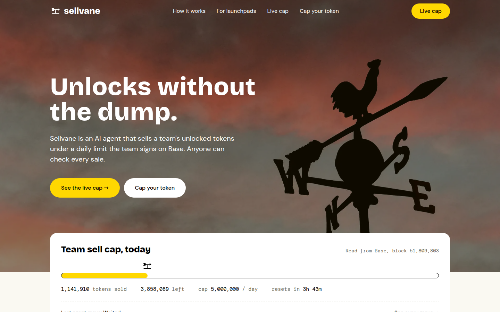
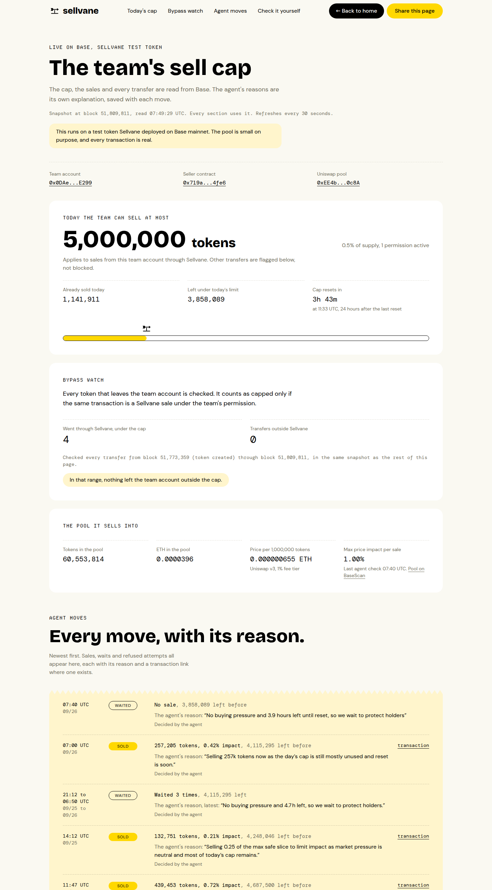
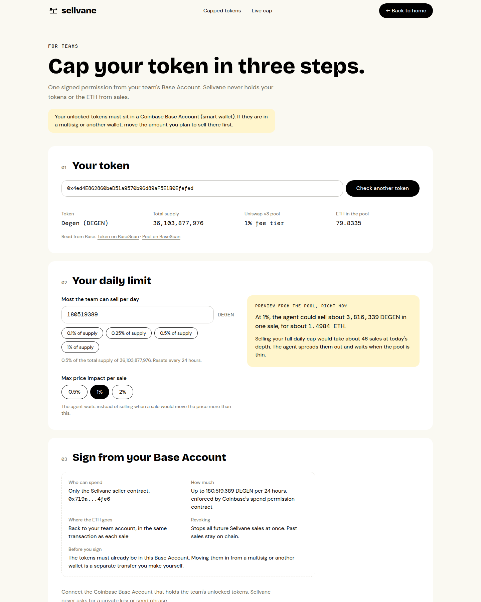
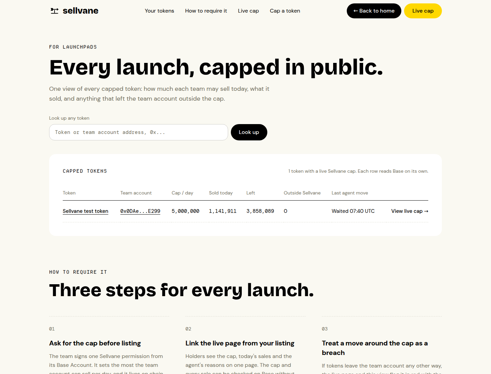
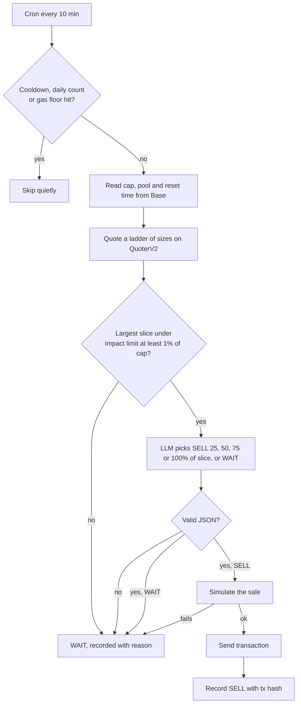
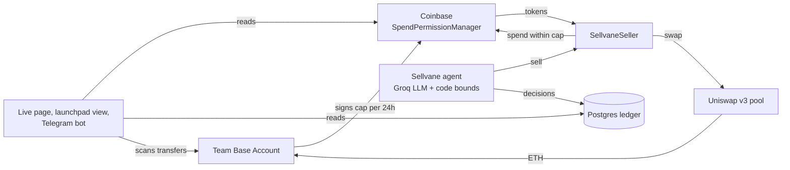
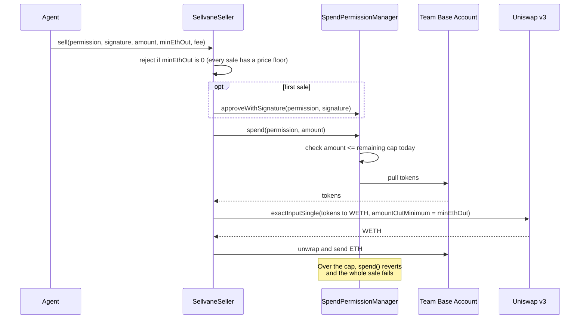

# Sellvane

[](https://github.com/mystiquemide/sellvane/actions/workflows/ci.yml)

An AI agent that sells a crypto team's unlocked tokens under a public daily cap enforced on Base.

The team signs one Coinbase spend permission: at most N tokens per 24 hours, spendable only by the Sellvane seller contract. The agent reads the Uniswap pool every 10 minutes and decides whether to sell a slice or wait. Anyone can check the cap, every sale and every transfer on Base.

| | |
|---|---|
| Live app | https://sellvane.midelabs.xyz |
| Live cap (running now) | https://sellvane.midelabs.xyz/live |
| Try it on your token | https://sellvane.midelabs.xyz/start |
| Telegram bot | https://t.me/sellvane_bot |
| X | https://x.com/sellvane |
| Demo video (2:16) | https://youtu.be/rRFIAhth9Ak |

[](https://youtu.be/rRFIAhth9Ak)

## Try it in 60 seconds

1. Open the [live cap](https://sellvane.midelabs.xyz/live). The number at the top is read from Coinbase's spend permission contract, not from our database.
2. Scroll to the agent ledger. Each row is one decision, SELL or WAIT, with the model's reason, the price impact and a BaseScan link.
3. Open [/start](https://sellvane.midelabs.xyz/start) and click "Try it with DEGEN". It reads a real Base token, finds its Uniswap v3 pool and previews the largest safe sale. No wallet needed to preview.
4. Message [@sellvane_bot](https://t.me/sellvane_bot) with `/cap`, `/moves` or `/bypass` to get the same data in Telegram.

## The problem

Vesting contracts say when a team's tokens unlock. They say nothing about how fast those tokens get sold. On unlock day holders can't see how much the team is allowed to dump, so they sell first and the price drops before the team moves at all. Launchpads carry the reputational cost when this happens.

## What Sellvane does

- **Public cap, enforced on chain.** The daily limit lives in Coinbase's SpendPermissionManager. Sellvane can't sell above it, and a sale over the limit is rejected by Base itself ([proof](https://basescan.org/tx/0xbe249cc824b778d0d740786eb7e0e6342449f9b897ed2145a4d8d500354e8f20)).
- **An agent that sells inside the cap.** An LLM chooses when and how much to sell, within hard limits computed by code.
- **Bypass watch.** Every transfer out of the team account is checked. A transfer that isn't a Sellvane sale shows in red on the live page. Sellvane can't block those transfers, only make them public.
- **Non-custodial.** Tokens stay in the team's Base Account until the moment of sale, and the ETH goes back to the same account in the same transaction. The team can revoke the permission at any time, which stops all future sales.

## Screenshots



| Live cap, bypass watch and agent ledger | Team setup with a real token |
|---|---|
|  |  |



## How the agent decides

Every 10 minutes, for each registered token:

1. **Read state from Base:** remaining cap, pool reserves, time until reset, recent sales.
2. **Compute hard bounds in code:** quote a ladder of sale sizes against Uniswap's QuoterV2 and find the largest slice under the team's price impact limit (default 1%). A slice below 1% of the daily cap isn't worth the gas, so the agent waits.
3. **Ask the model (Groq, `openai/gpt-oss-120b`):** SELL 25%, 50%, 75% or 100% of that safe slice, or WAIT, with a one-line reason. Output is validated with zod. Anything invalid becomes WAIT.
4. **Simulate, then send:** the sale is simulated against the chain before it's signed. If the simulation fails, nothing is sent.
5. **Record:** the decision, reason, impact and transaction go into the ledger shown on the live page.



Rate limits in code, not in the prompt: at least 30 minutes between sales, at most 12 sales a day, and no sale if the operator's gas balance is below the floor.

## Proof on Base mainnet

A test token with a real Uniswap v3 pool runs through the full flow. All numbers below come from Base.

| | |
|---|---|
| Daily cap | 5,000,000 tokens (0.5% of supply) |
| Agent sales | 4, highest price impact 0.72% |
| Over-cap attempt | 1, rejected by Base |
| Transfers outside Sellvane | 0 |
| Example sale | [0xf2555f5f...06fd](https://basescan.org/tx/0xf2555f5fa5fc9b31e9414e786d63744584e8e8503d002ce83a9914c7f99406fd) |
| Rejected sale | [0xbe249cc8...8f20](https://basescan.org/tx/0xbe249cc824b778d0d740786eb7e0e6342449f9b897ed2145a4d8d500354e8f20) |

### Contracts

| Contract | Address |
|---|---|
| SellvaneSeller (verified) | [0x719a235Be27F0b7B7F82775aFBEA6a2dE6264fe6](https://basescan.org/address/0x719a235Be27F0b7B7F82775aFBEA6a2dE6264fe6#code) |
| Test token (verified) | [0xe7f3ee414aC0D341763dCE8E3AB6A2f630A8C8Cf](https://basescan.org/address/0xe7f3ee414aC0D341763dCE8E3AB6A2f630A8C8Cf#code) |
| Team Base Account | [0x0DAeA8d6d0CBd842cBE8Df6887E0c1792276E299](https://basescan.org/address/0x0DAeA8d6d0CBd842cBE8Df6887E0c1792276E299) |
| Uniswap v3 pool | [0xEE4b9eEB9F2a2de45844d03a70b89416E4620c8A](https://basescan.org/address/0xEE4b9eEB9F2a2de45844d03a70b89416E4620c8A) |
| Coinbase SpendPermissionManager | [0xf85210B21cC50302F477BA56686d2019dC9b67Ad](https://basescan.org/address/0xf85210B21cC50302F477BA56686d2019dC9b67Ad) |

## Integrations

| Integration | What Sellvane uses it for |
|---|---|
| [Coinbase spend permissions](https://docs.base.org/identity/smart-wallet/concepts/features/optional/spend-permissions) | The daily cap. `SpendPermissionManager` enforces it on chain, and `approveWithSignature` registers it from one signature. |
| [Base Account SDK](https://docs.base.org/base-account) | Connecting the team's smart wallet and requesting the permission in the browser (`@base-org/account`). |
| [Uniswap v3](https://docs.uniswap.org/contracts/v3/overview) | Finding the token's WETH pool via the factory, pricing sales with QuoterV2, and executing through SwapRouter02. |
| [Groq](https://groq.com) | Runs `openai/gpt-oss-120b` for the SELL or WAIT decision and its reason. |
| [Base mainnet](https://base.org) | Every read and write: cap state, pool reserves, transfer logs for the bypass watch. |
| [BaseScan](https://basescan.org) | Verified contract source, and a link for every sale and address on the site. |
| [Telegram Bot API](https://core.telegram.org/bots/api) | [@sellvane_bot](https://t.me/sellvane_bot) mirrors the site: `/cap`, `/moves`, `/bypass`, `/pool`, `/check`, `/tokens`. |
| [Neon Postgres](https://neon.tech) | The agent ledger, token registry and transfer scan cache. |
| [Vercel](https://vercel.com) | Hosting for the app and API routes. |

## Who it's for

- **Holders:** one number that tells you the most the team can sell through Sellvane today, and a public record of everything that left the account.
- **Teams:** a credible way to sell unlocked tokens without the market assuming the worst.
- **Launchpads:** [/launchpad](https://sellvane.midelabs.xyz/launchpad) lists every capped token in one table, so a launchpad can require a Sellvane cap as a listing condition.

## Why this is new

Existing TWAP tools, like CoW Protocol's, split one order over time. They don't give holders a standing public limit, and they don't flag sales that go around it. Sellvane uses Coinbase spend permissions, which were built for subscriptions, as a public sell limit. The cap, the agent and the bypass watch sit on one page anyone can check.

## Architecture



One sale, step by step:



- `contracts/`: SellvaneSeller in Solidity, with 11 Foundry tests on a Base fork.
- `src/lib/agent/`: bounds, model decision, tick loop.
- `src/lib/chain/`: permission, pool and token reads.
- `src/app/`: Next.js pages and API routes (`/api/tokens`, `/api/tick`, `/api/telegram`).

Stack: Next.js, viem, Base Account SDK, Coinbase spend permissions, Uniswap v3, Groq, Postgres (Neon), Foundry.

## Limits

- The cap covers sales from the registered team account through Sellvane. Tokens in other wallets aren't capped. Transfers out of the account are flagged, not blocked.
- Uniswap v3 WETH pools only. Aerodrome and Uniswap v4 aren't supported yet.
- Tokens must sit in a Coinbase Base Account (smart wallet), because spend permissions need one.

## Run locally

```bash
git clone --recursive https://github.com/mystiquemide/sellvane && cd sellvane
npm install
cp .env.example .env.local   # RPC, keys, database
npm run db:migrate
npm run dev
npm test                     # 30 tests; 14 need the database and team key and skip without them
cd contracts && forge test --fork-url $BASE_RPC_URL   # 11 fork tests
```

`npm run tick` runs one agent cycle. In production a cron calls `POST /api/tick` with `TICK_SECRET`.

## License

MIT
